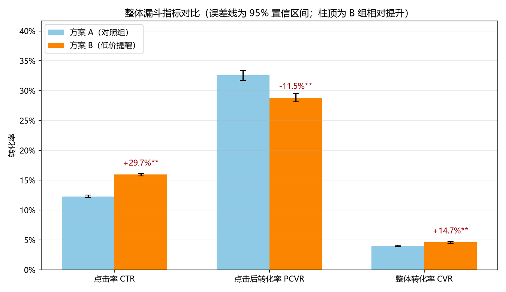
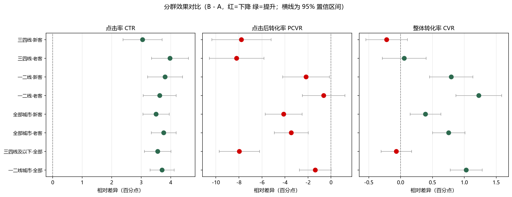

# 首页促销卡「低价提醒」A/B 实验分析报告

> 模拟数据案例分析 ｜ 双比例 z 检验 + 漏斗拆解 + 分群分析（HTE）

## 一、实验背景与业务问题

移动点单 App 计划在首页促销卡片上增加「低价提醒」角标（方案 B），与现状（方案 A）对比。
要回答两个问题：
1. 角标能否让更多用户点击促销卡（**CTR 提升**）？
2. 点击后能否真正带来更多订单（**CVR 提升**）？

常见风险：角标吸引好奇点击，但用户点击后发现受起送门槛、凑单规则限制，导致**后点击转化率 PCVR 下降**，最终 CVR 未必提升。

## 二、实验设计

| 项目 | 说明 |
| --- | --- |
| 样本量 | 共 200,000 名用户（A 组 99,706 / B 组 100,294） |
| 分流方式 | 基于 user_id 的稳定 hash 分流（50/50），同一用户始终在同一组 |
| 指标 | CTR=点击/曝光；PCVR=转化/点击；CVR=转化/曝光（CVR = CTR × PCVR） |
| 统计方法 | 双比例 z 检验（95% 置信区间）、SRM 分流校验、A/A 检验 |
| 分群维度 | 城市线级（一二线 / 三四线及以下）× 用户类型（新客 / 老客） |

## 三、数据质量校验

- **SRM 分流均衡性**：A/B 实际样本占比与 50/50 无显著偏差（卡方=1.73，p=0.1886）→ **通过**
- **A/A 检验**：对照组内随机拆分两组，CTR 差异 p=0.5287、CVR 差异 p=0.2710 → **通过**（随机化与指标口径无系统偏差）

## 四、整体结果

| 指标 | 方案 A | 方案 B | 相对提升 | 差异 95% CI | p 值 |
| --- | --- | --- | --- | --- | --- |
| 点击率 CTR | 12.29% | 15.94% | +29.7%** | [+3.34%, +3.95%] | 0 |
| 点击后转化率 PCVR | 32.55% | 28.80% | -11.5%** | [-4.83%, -2.66%] | 1.164e-11 |
| 整体转化率 CVR | 4.00% | 4.59% | +14.7%** | [+0.41%, +0.77%] | 7.866e-11 |

**漏斗拆解（CVR = CTR × PCVR）**：B 组点击率显著提升，但点击后转化率下降。整体 CVR 是否为正，取决于两类效应的净结果。

## 五、分群分析（HTE）

| 分群 | CVR_A | CVR_B | CVR 提升 | CVR p 值 | 解读 |
| --- | --- | --- | --- | --- | --- |
| tier_1_2_all | 4.60% | 5.63% | +22.4%** | 4.441e-16 | 显著提升 |
| tier_3_4_all | 3.11% | 3.04% | -2.1% | 0.5888 | 无显著差异 |

## 六、结论与建议

结合整体与分群结果，形成以下决策建议：

1. **一二线城市：建议放量上线**。CVR 提升 +22.4%（p=4.441e-16），点击与转化同步改善，是本次改版的主要收益来源。
2. **三四线及以下城市：暂缓全量，先优化承接体验**。该分群点击率提升明显，但 PCVR 下降 11.5% 以上，CVR 提升 -2.1%（p=0.5888）——角标吸引的点击未能有效转化为订单，建议先调整起送门槛 / 凑单提示，再做一轮验证实验。
3. **监控老客转化**：老客对价格敏感度更高，需关注「低价提醒」是否带来客单价稀释，建议将 GMV、客单价、优惠券成本加入守卫指标（guardrail）。

## 七、局限与后续

- 本实验数据为**模拟数据**，用于演示完整分析流程，真实结论需以线上实验为准；
- 后续可补充：CUPED 方差缩减、分阶段放量（10%→25%→50%→100%）、长期留存与 LTV 观测、成本/收益测算。
