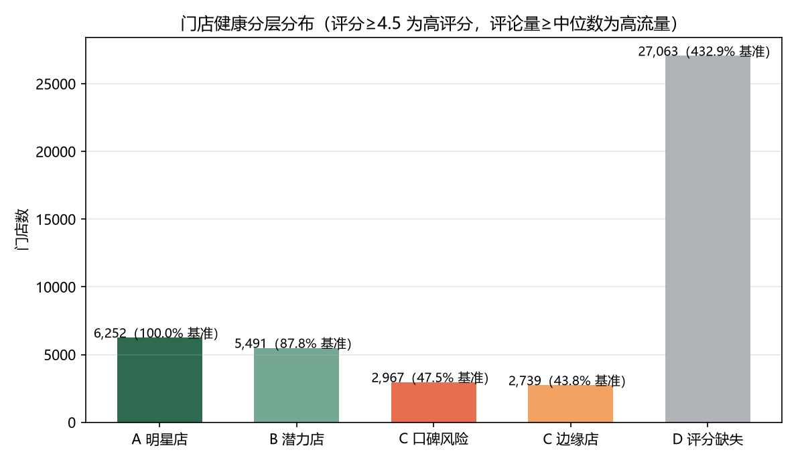
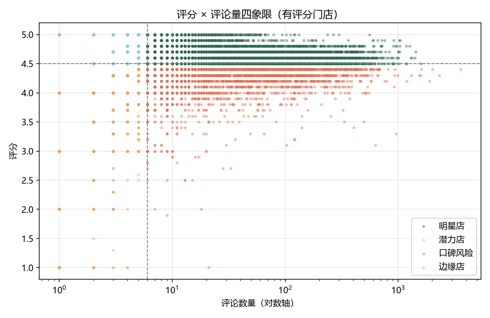
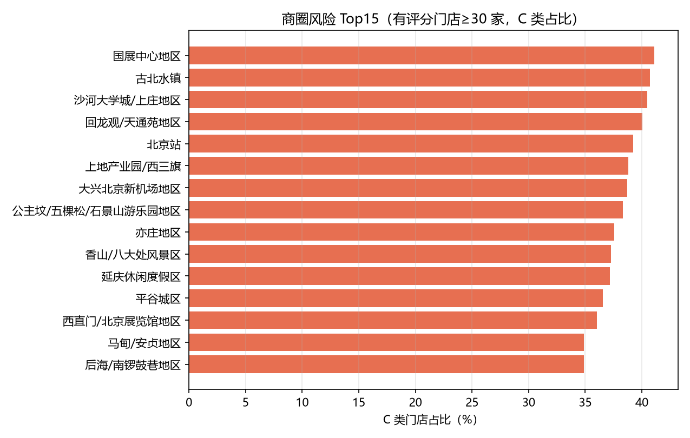
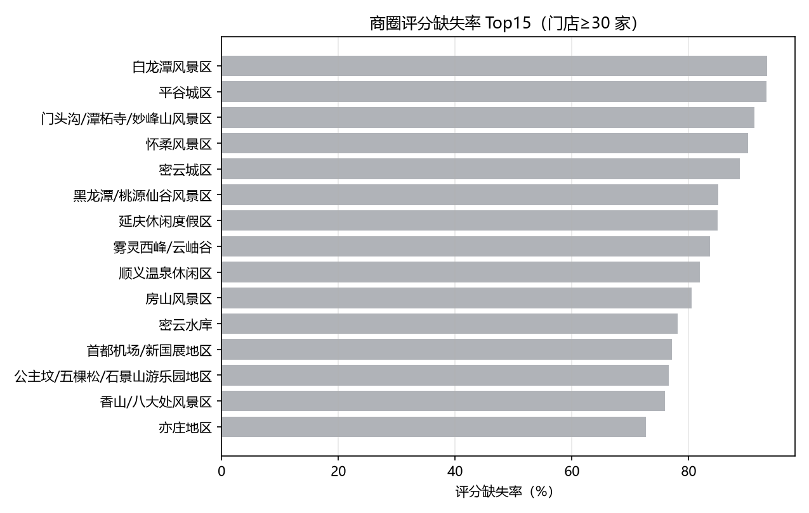
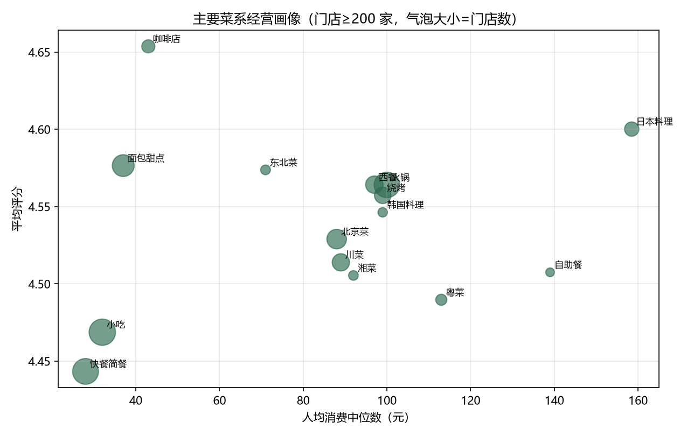
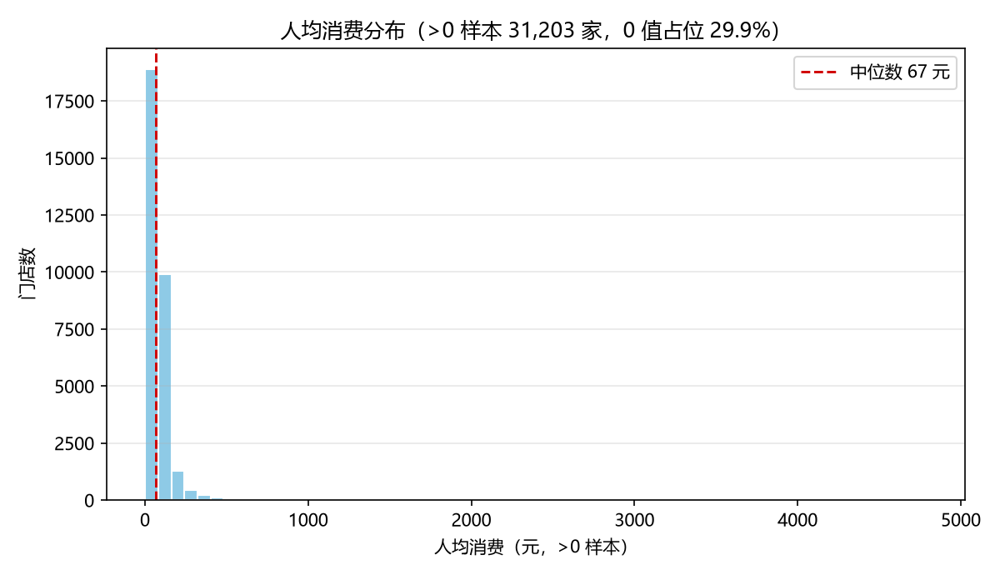

# 餐饮门店经营诊断看板

> 基于北京市 4.4 万餐饮商铺真实数据 ｜ 门店健康分层 + 商圈/菜系诊断 + 风险识别

## 一、分层规则

- 高评分：评分 ≥ 4.5；高流量：评论数量 ≥ 中位数 6 条
- A 明星店（高评分 × 高流量）/ B 潜力店（高评分 × 低流量）
- C 口碑风险（低评分 × 高流量）/ C 边缘店（低评分 × 低流量）
- D 评分缺失（无评分门店，多为无评论新店）

## 二、核心指标

| 指标 | 数值 |
| --- | --- |
| 总门店数 | 44,512 |
| 有效评分率 | 39.2% |
| 平均评分(有评分) | 4.53 |
| 人均消费中位数 | 37 元 |
| 评分缺失率 | 60.8% |
| 风险门店占比(C类) | 12.8% |

风险门店（C 类）共 **5,706** 家，占 **12.8%**。

## 三、图表

## 四、风险门店清单（脱敏）

共 5,706 家，完整清单见 `risk_store_list.csv`（仅含分析字段，不含店名/地址/电话）。

| 店铺id | 评分 | 评论数量 | 人均消费 | 归属商圈 | 菜系类型 |
| --- | --- | --- | --- | --- | --- |
| 133533015 | 1.0 | 21 | 274 | 亚运村/奥体中心地区 | 江浙菜 |
| 130380412 | 1.0 | 4 | 126 | nan | 烧烤 |
| 13030556 | 1.0 | 4 | 52 | 平谷城区 | 快餐简餐 |
| 78813743 | 1.0 | 3 | 104 | 公主坟/五棵松/石景山游乐园地区 | 咖啡店 |
| 122741708 | 1.0 | 3 | 120 | 永定门/南站/大红门/南苑地区 | 鲁菜 |
| 130854172 | 1.0 | 2 | 0 | 公主坟/五棵松/石景山游乐园地区 | 小吃 |
| 79422665 | 1.0 | 2 | 79 | 前门/天坛公园/崇文门 | 川菜 |
| 24562246 | 1.0 | 2 | 123 | nan | 火锅 |
| 132791104 | 1.0 | 2 | 37 | 大兴北京新机场地区 | 面包甜点 |
| 8638406 | 1.0 | 2 | 41 | 上地产业园/西三旗 | 咖啡店 |
| 120801370 | 1.0 | 2 | 0 | 香山/八大处风景区 | nan |
| 25045503 | 1.0 | 2 | 0 | 永定门/南站/大红门/南苑地区 | nan |
| 143365359 | 1.0 | 2 | 0 | 三里屯/工体/东直门地区 | 小吃 |
| 127749186 | 1.0 | 2 | 113 | 西直门/北京展览馆地区 | 火锅 |
| 130015856 | 1.0 | 2 | 101 | 北京西站/丽泽商务区 | 粤菜 |
| 120330860 | 1.0 | 2 | 126 | 平谷城区 | 北京菜 |
| 12495011 | 1.0 | 2 | 67 | nan | 北京菜 |
| 17515263 | 1.0 | 2 | 56 | nan | 快餐简餐 |
| 7022239 | 1.0 | 1 | 16 | 中关村/五道口 | 快餐简餐 |
| 22519980 | 1.0 | 1 | 48 | nan | 小吃 |

## 五、数据与合规说明

- 看板基于**真实商铺数据**构建，分析结果均为聚合统计，风险清单已脱敏；
- 原始数据不随仓库公开（代码与数据分离），运行方式见 README。
