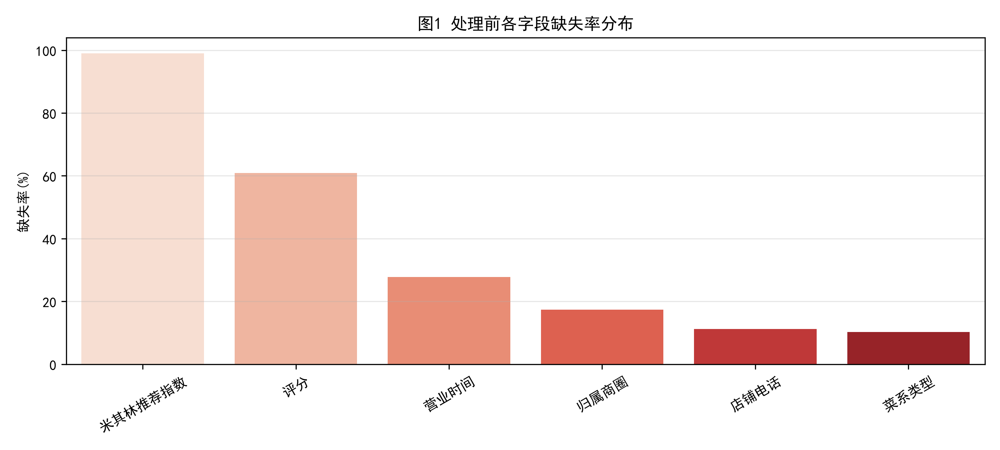
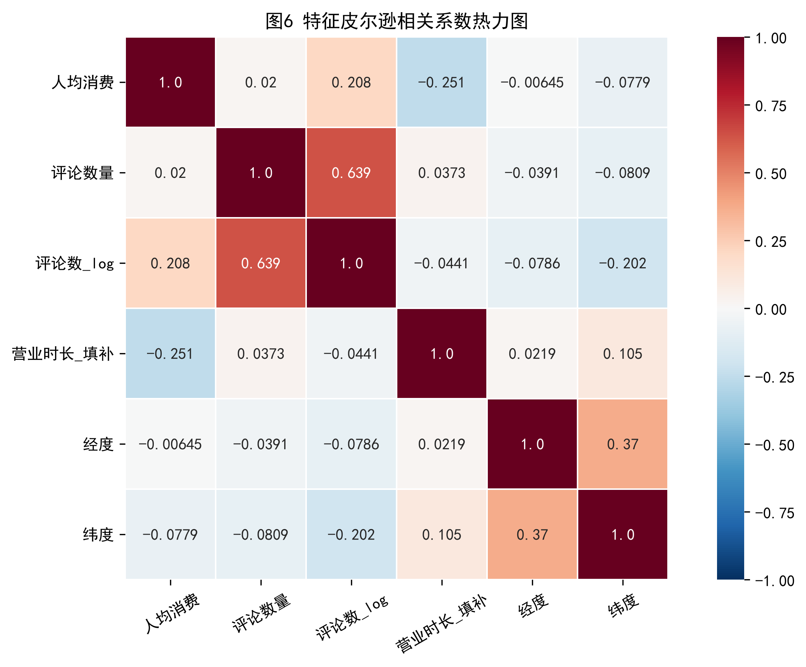
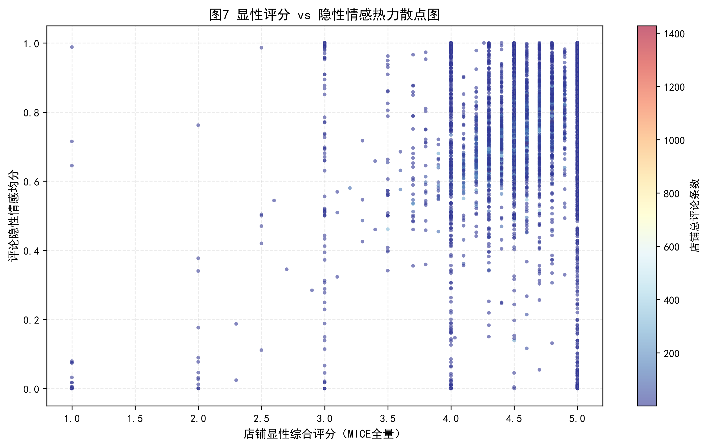

# 北京餐饮大数据：缺失机制判定与预处理全流程（含情感分析实证）

> 数据分析实战项目 ｜ Python + Pandas/Sklearn/Statsmodels ｜ 真实 O2O 餐饮数据

基于北京市 **44,512 家餐饮商户** 与 **212,099 条用户评论** 的真实数据，完整实现「缺失机制诊断 → 异常值处理 → 多策略填补 → 特征工程 → 多重插补 → 情感分析」的一站式数据预处理流水线，并对每一步处理效果进行**可量化的评估与论证**。

---

## ✨ 核心亮点（量化结果）

| 环节 | 方法 | 关键结果 |
| --- | --- | --- |
| 缺失机制判定 | 组间差异检验 + Logistic + 区域卡方 | 评分缺失由「有无评论」驱动，判定为 **MAR**（McFadden 伪 R²=0.58） |
| 异常值处理 | Z-score / IQR / 缩尾 三方法对比 | 右偏数据下选择 P1/P99 缩尾，仅修正 2.0% 极端值 |
| 人均消费填补 | 菜系 × 区域双维中位数 + 分层抽样核验 | 真实 MAE 37.3~45.3 元，优于全局均值(56.6)/中位数(55.0) |
| 填补无偏评估 | MCAR 模拟缺失实验（随机屏蔽 20%） | 双维中位数 MAE=35.9，与树模型（RF 38.9 / XGB 39.0）相当 |
| 营业时长填补 | 文本解析 + CV 异质性诊断 + KNN 修正 | 留出验证 MAE=2.8h（全市均值 12.2h） |
| 评分缺失处理 | MICE 链式方程多重插补 ×5 套 | Rubin 规则合并，消除删除样本的选择偏差 |
| 情感分析 | SnowNLP 情感打分 + 偏相关控制混杂 | 情感-评分偏相关 r=0.140（p<0.001，n=197,543） |

## 🛠 技术栈

Python · Pandas · NumPy · SciPy · Scikit-learn · Statsmodels · Matplotlib · Seaborn · SnowNLP · XGBoost · Jieba

## 🔄 处理流程


九个模块由 [main.py](main.py) 统一编排，每个模块对应 `src/` 下的一个独立文件，报告与图表自动输出。

## 📊 关键图表

| 缺失率诊断 | 特征相关性 |
| --- | --- |
|  |  |



全部图表：图1~图8 + 辅助图（人均消费分布、PCA 方差贡献、异常值对比、情感散点等）。

## 📁 目录结构

```
├── main.py                     # 流水线入口（按顺序编排 9 大模块）
├── src/
│   ├── data_loader.py          # 数据加载、去重、基线统计
│   ├── missing_diagnosis.py    # 缺失机制分析（MCAR/MAR/MNAR）
│   ├── outlier_detection.py    # 异常值方法对比（Z-score/IQR/缩尾）
│   ├── imputation.py           # 人均消费/营业时长填补、MCAR 模拟、CV/KNN
│   ├── feature_engineering.py  # 编码、文本清洗、复合特征、特征筛选、PCA
│   ├── multiple_imputation.py  # MICE 多重插补 + 主分析
│   ├── sentiment_analysis.py   # 情感分析 + 偏相关
│   └── common.py               # 公共工具（报告输出、统计合并）
├── 报告.txt                    # 完整分析报告（含每步结论与简历话术）
├── 图1~图8.png                 # 全流程可视化图表
├── sample_data.csv             # 商铺表示例数据（纯虚构，仅展示结构）
├── sample_comment_data.csv     # 评论表示例数据（纯虚构，仅展示结构）
└── requirements.txt            # 依赖清单
```

## 🚀 快速开始

```bash
# 1. 安装依赖（建议 Python 3.9+）
pip install -r requirements.txt

# 2. 原始数据未随仓库公开（代码与数据分离），如需复现请将
#    北京市餐饮商铺数据(4.4w).xlsx / 北京市餐饮商铺评论数据(21w).xlsx
#    放入项目根目录（字段结构见「数据说明」与 sample_*.csv）

# 3. 运行
python main.py

# 4. 输出
#    报告.txt + 全部图表（图1~图8）
```

## 📦 数据说明

本项目遵循**代码与数据分离**原则：仓库不包含任何真实爬取数据，仅提供纯虚构的示例文件（`sample_data.csv` / `sample_comment_data.csv`）用于展示表结构。

- **商铺表**（真实数据 44,512 行 × 16 列）：店铺id、店铺名称、经度、纬度、人均消费、评分、评论数量、距离描述、米其林推荐指数、归属商圈、菜系类型、city、county、营业时间、地址、店铺电话
- **评论表**（真实数据 212,099 行 × 6 列）：id、name、user_id、content、scores、pag_time
- **清洗结果**：精确去重 346 条（同名同址）→ 商铺 44,166 家
- **人工核验**：按「区域 × 菜系」分层抽样 120 条，双人独立核验 0 值占位性质（Wilson 95% 置信区间）
- 如需完整复现，请自行通过合法渠道获取原始数据，并按 [src/data_loader.py](src/data_loader.py) 中的路径放入项目根目录

## 📝 项目价值

本项目展示了数据分析岗位所需的核心能力：

1. **统计思维**：缺失机制（MCAR/MAR/MNAR）的统计检验与论证，而非默认「直接删除或均值填补」
2. **方法严谨性**：用分层抽样 + 留出验证 + MCAR 模拟缺失实验评估填补误差，给出保守上界估计
3. **工程化能力**：模块化流水线设计，单命令复现完整分析，输出报告与图表
4. **业务理解**：针对餐饮数据的右偏分布、0 值占位、文本噪声等真实问题设计处理策略

## ⚖️ 法律与合规声明

- 本项目仅供学习交流使用；
- 禁止将代码用于任何商业用途或非法目的；
- 请勿对目标网站进行高频抓取，以免对其造成负担；
- 数据版权归原网站所有。
